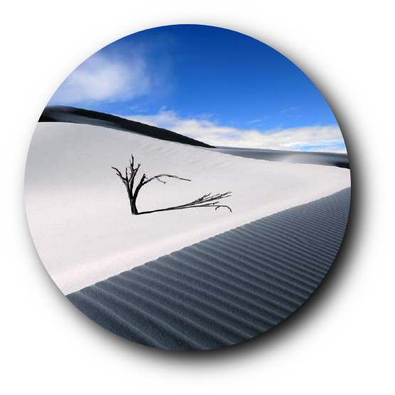

<div align="center">
  
  <h1>user7210unix</h1>
  <p>Linux tinkerer. I build things for the terminal and the browser.</p>

  [](https://github.com/user7210unix)
</div>


## Featured Projects

| Project | Description | Link |
|---|---|---|
| **iChan** | Single-file 4chan reader with an iOS-inspired UI. iMessage bubbles, lazy images, filters, dark mode. | [Live](https://user7210unix.github.io/ichan/) |
| **Wallpapers** | Curated wallpaper repository with a browsable web frontend. | [Site](https://user7210unix.github.io/papes/) |
| **ChanChan** | lightweight 4chan reader. | [Site](https://user7210unix.github.io/chanchan/) |
| **Board Reader** | Newspaper-layout reader for /pol/ — focused reading experience. | [Site](https://user7210unix.github.io/Board-Reader/) |
| **Dotfiles** | My personal config collection — WM, shell, editors, and more. | [Site](https://user7210unix.github.io/dotfiles/) |
| **Emacs** | My personal Emacs config. | [Site](https://github.com/user7210unix/emacs) |


---

## Tech & Tools

**Languages**

```
HTML / CSS       ████████████████████░░   88%
JavaScript       ███████████████░░░░░░░   65%
ELisp            ██████████████░░░░░░░░   60%
Shell / Bash     █████████████░░░░░░░░░   58%
Python           ████████░░░░░░░░░░░░░░   35%
```

**Environment**

```
OS               Linux
Shell            Zsh
Editor           Emacs
Terminal         Alacritty
```

---


## Repos Worth Looking At

These aren't mine but they're in my setup or have influenced it:

| Repo | What it is |
|---|---|
| [DankMaterialShell](https://github.com/AvengeMedia/DankMaterialShell) | Desktop shell for wayland compositors built with Quickshell & GO |
| [dots-hyprland](https://github.com/end-4/dots-hyprland) | End-4's Hyprland config — one of the best out there |
| [Tail-R/dots](https://github.com/Tail-R/dots) | Clean Openbox configuration |
| [reorr/my-theme-collection](https://github.com/reorr/my-theme-collection) | GTK and icon theme collection |
| [wzhchin/config](https://github.com/wzhchin/config) | Wzhcin's configuration files |
| [Cozytile/config](https://github.com/Darkkal44/Cozytile) | Cozytile files |
---

<div align="center">

  [](https://github.com/user7210unix)
  [](https://gitlab.com/Oglo12)

</div>
