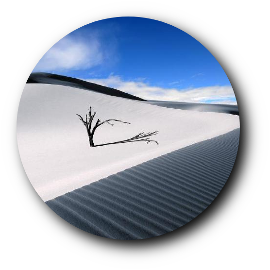

# user7210unix

Linux tinkerer. I build things for the terminal and the browser.

 

## Featured Projects

| Project | Description | Link |
|---|---|---|
| **iChan** | A minimal, chat-style reader for 4chan. | [Site](https://user7210unix.github.io/ichan/) |
| **ChanChan** | Lightweight 4chan reader. | [Site](https://user7210unix.github.io/chanchan/) |
| **Wallpapers** | Curated wallpaper collection with a browsable web frontend. | [Site](https://user7210unix.github.io/papes/) |
| **Suckless** | A minimal X11 Unix workstation built around the suckless philosophy. | [Repo](https://github.com/user7210unix/suckless) |
| **Dotfiles** | Personal config collection — WM, shell, editors, and more. | [Site](https://user7210unix.github.io/dotfiles/) |
| **Emacs Config** | Personal Emacs configuration. | [Repo](https://github.com/user7210unix/emacs) |

 

## Environment

| | |
|---|---|
| **OS** | Linux |
| **Shell** | Zsh |
| **Editor** | Emacs |
| **Terminal** | Alacritty |

 

## Repos Worth Looking At

Not mine, but in my setup or shaped how I configure things.

| Repo |  |
|---|---|
| [DankMaterialShell](https://github.com/AvengeMedia/DankMaterialShell) | Desktop shell for Wayland compositors, built with Quickshell and Go |
| [dots-hyprland](https://github.com/end-4/dots-hyprland) | end-4's Hyprland config — one of the best out there |
| [Tail-R/dots](https://github.com/Tail-R/dots) | Clean Openbox configuration |
| [reorr/my-theme-collection](https://github.com/reorr/my-theme-collection) | GTK and icon theme collection |
| [wzhchin/config](https://github.com/wzhchin/config) | wzhchin's configuration files |
| [Cozytile](https://github.com/Darkkal44/Cozytile) | Cozytile config files |
| [quartz-rice](https://gitlab.com/Oglo12/quartz-rice) | Oglo12's dotfiles |
| [TWM/etc configs](https://www.cpcnw.co.uk/twm2/themes/rackservers/) | rackservers configuration |
| [IoskeleyMono](https://github.com/ahatem/IoskeleyMono) | A font worth having |
| [base16-emacs](https://github.com/tinted-theming/base16-emacs) | base16-emacs |

 

